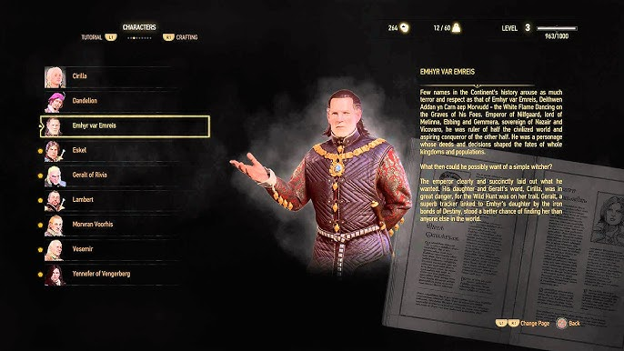
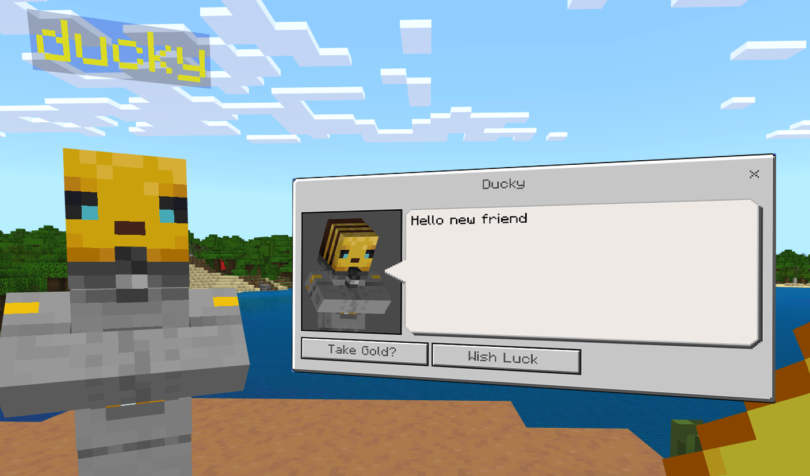
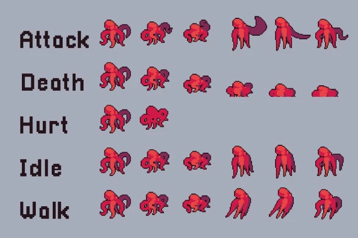

## **adventureGame...and the future for it...**

### Staring Page...

For the adventureGame I would like to add a start page into the game. When you first open up the application you come to a nice and clean page that shows the title of the game, and has buttons for you to click. The page can be used to have a idea of the game before the start and a place to change your settings, get information about NPCs, etc!

### **Inspiration:**

#### Button(s):
**#1: Start Button**
    - This button will be the one you press that launches the game. When pressed you immediately start the level and continue as normal.

**#2: Settings Button**
    - This button, once clicked will lead you to a other page where it will give you stats for things you can change in the game. Which could be character speed, gravity, and more!

**#3: NPCs About Page**
    - This button will lead you into a information page about all the NPCs that are avaliable in the game. I hope to add a small description box next to the image of the NPC to give information about it which informs the player on who the NPCs are/based on.

### **Inspiration:**

### **Updates to Current gameLevels**

#### Idea #1:

gameLevelDesert is a simple level with 3 Npcs you can interact with, they give you some information about themselves and it ends simpliy there. To make the level more intresting an fun there can be more interacting with the Npcs, possibly asking it questions (with multiple choice) and/or it can give you questions for you to try to answer once it gives you some information about itself!

#### Inspiration:

#### Idea #2:

gameLevelWater is very simple and very bland, some additions that can be added is more Npcs, and more interactions with them. Also changing the sprite could be good due to it only moving in one direction.

#### Idea #3:

When you play as a player in the game you move in a very...weird way. You start off walking into a random sprint. I would like to change it to when you walk, you walk a consistent pace, when you run you can press a key (shift or s) and makes your running speed faster and more durable. I am taking the inspriation with the walk/run pace with the past game platformer4x mario speeds, etc.